<p align="center">
  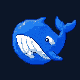
</p>

<h1 align="center">XY DeepSeek Pet</h1>

<p align="center">
  <a href="./README.md">中文</a> · English
</p>

<p align="center">
  
  
  
  
  
  
  
</p>

<p align="center">
  <b>An unofficial, open-source desktop companion and open interaction base for DeepSeek Harness.</b><br>
  Built on three core pillars: <b>Useful, Playful, and Extensible</b> — ready out of the box, with full freedom for hackers and creators to tinker.
</p>

<p align="center">
  <a href="#why-we-built-this">Why</a> ·
  <a href="#useful-effortless-single-screen-workflow">Useful</a> ·
  <a href="#playful-alive-and-engaging">Playful</a> ·
  <a href="#extensible-open-for-tinkering">Extensible</a> ·
  <a href="#installation">Install</a> ·
  <a href="#usage-and-gestures">Usage</a> ·
  <a href="#hacker-and-developer-guide">Hacker Guide</a>
</p>

<p align="center">
  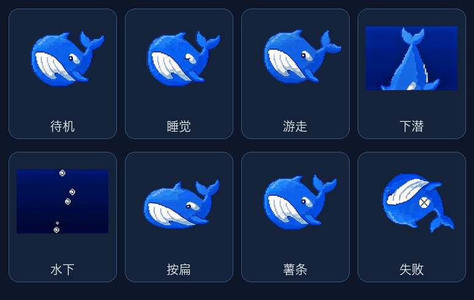
</p>

---

## Why We Built This

In short: **Stop switching full-screen windows just to check progress, dictate a follow-up, or click a single approval.**

When you're deeply focused on arranging audio tracks in a DAW (like REAPER), writing code in an IDE, or editing docs in Feishu/Notion on a single display, having to leave your canvas and switch to a full-screen browser window breaks your creative flow.

XY Pet lives right beside you:
- Summon it instantly near your cursor with `Cmd+Shift+P`;
- Long-press for 0.5s to dictate with your OS native speech engine;
- Single-click approvals (Allow once / Reject) right in the floating bubble;
- Dismiss it whenever you're done — your primary workspace never gets interrupted.

| Core Pillar | Your Experience |
| :--- | :--- |
| **Useful (Effortless)** | Single-screen freedom, global summon, 0.5s native voice dictation, inline 1-click approvals |
| **Playful (Alive)** | Real underwater dive to prevent frozen UI, squash feedback, throw & bounce, signature whale call, 0.1% rare chest |
| **Extensible (Hackable)** | Swap skins (Petdex compatible), swap speech models (`VoiceTranscriber`), swap sound packs, or ask your Agent to configure it |

> 🔒 **Local-First Security Guarantees**: Everything runs 100% on your local machine with zero external cloud relays. Inter-process communication binds exclusively to `127.0.0.1` loopback with ephemeral credentials; audio transcription happens strictly on-device and is deleted immediately; hidden reasoning (`reasoning-delta`) and private tokens never reach the desktop; theme packs are data-only sandboxes (images + JSON) that never execute arbitrary scripts.

---

## Useful (Effortless Single-Screen Workflow)

Get routine tasks and approvals done in 5–10 seconds without hunting for browser tabs.

<p align="center">
  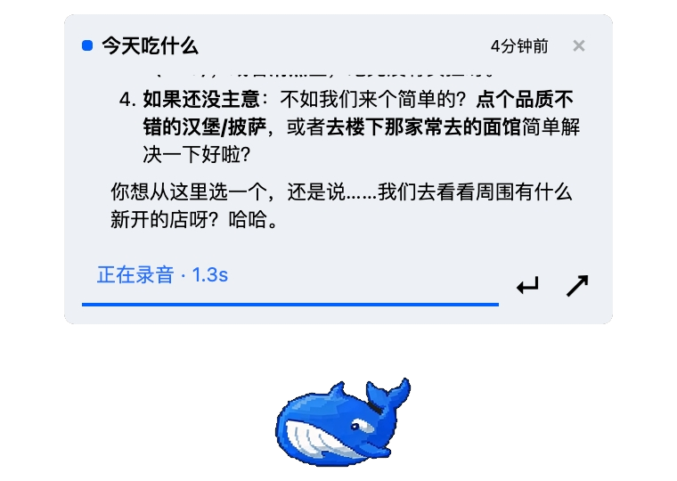
  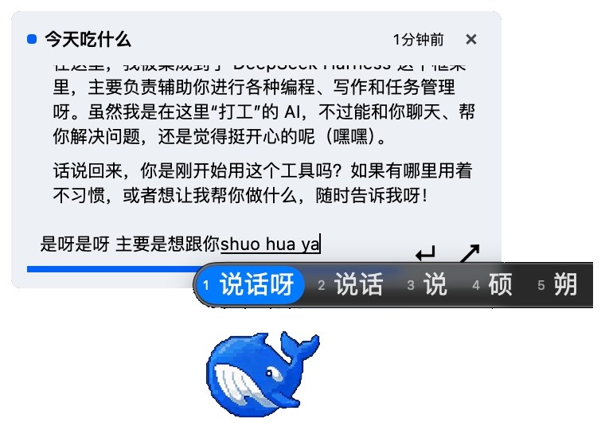
</p>

- **Out-of-the-Box System Dictation**: Long-press for `0.5` seconds to speak with squashed haptic feedback; speech is transcribed and placed directly into the reply composer for review before sending. Uses OS-native speech recognition (macOS Speech Framework / Windows speech pack) — **zero setup, zero API cost, ultra-low latency**.
- **Floating Session Bubbles & Approvals**: Keeps up to 3 active session bubbles. When the Agent needs permissions or asks a question, actionable "Allow once / Reject" buttons pop up directly on your desktop.

<p align="center">
  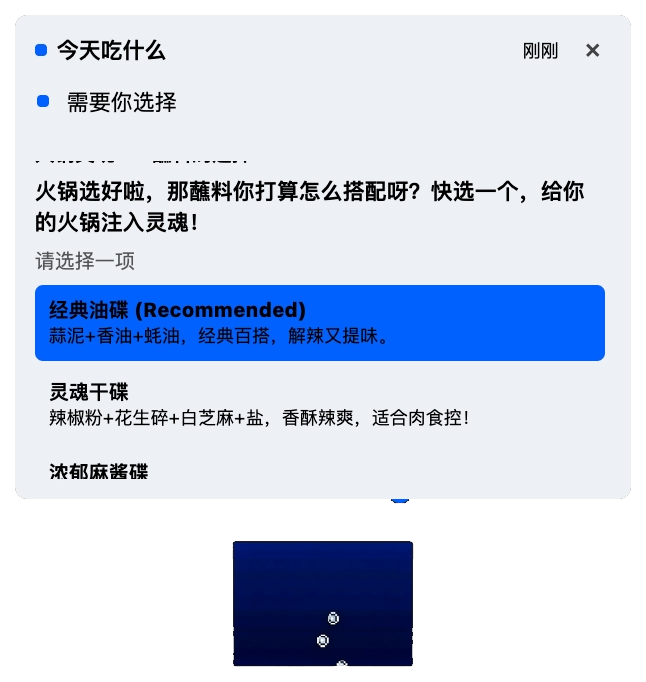
  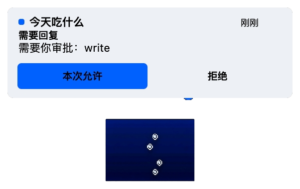
</p>

- **Customizable Shortcuts & Gestures**: Global shortcut `Cmd+Shift+P` is fully rebindable. Long-press and double-click can independently map to "Voice Dictation", "Open Latest Chat", "Open Harness Web GUI", or "No Action".
- **One-Click Desktop Launcher**: Easily create a desktop shortcut that launches Harness, Web GUI, and the pet companion in one click, with support for custom PNG icons.

---

## Playful (Alive and Engaging)

Not a lifeless widget, but a responsive desktop companion that synchronizes with real Agent lifecycles.

<p align="center">
  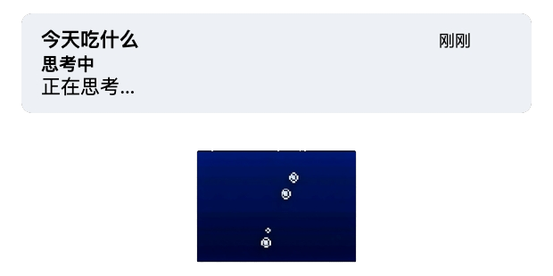
  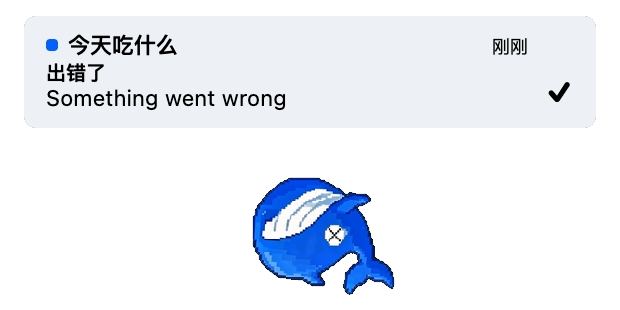
</p>

<p align="center">
  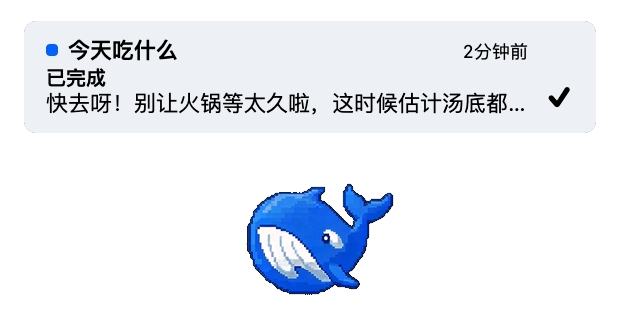
  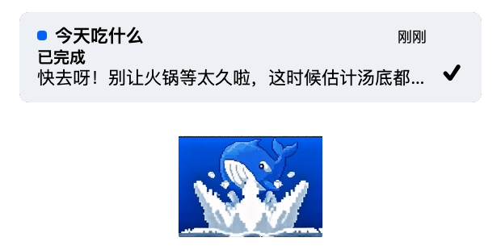
</p>

- **Real Dive to Signal Work (No Frozen Screens)**: When an Agent task starts, the whale dives into the water; during tool execution, it stays underwater working so you always know it's actively processing.
- **Whale Call & Random Souvenir Loot Pool**: Surfaces with a cheerful, crisp whale call upon task completion. Regular runs bring back random souvenirs (fries, holy sword, terminator shades, eyepatch, branch, boot).
- **Immutable 0.1% Rare Chest Drop**: An immutable `0.1%` rare treasure chest jackpot is hardcoded into the runtime, ensuring true randomness that cannot be tampered with by custom theme packs.

<p align="center">
  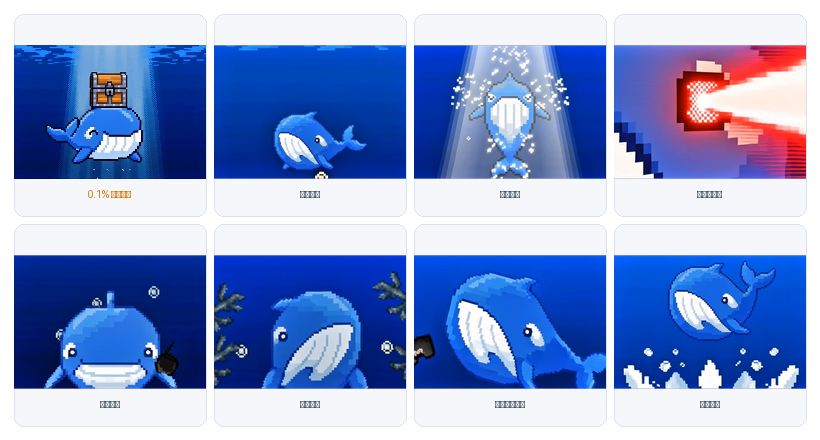
</p>

- **Pointer Chasing & Throw Physics**: Enable pointer chasing to have the whale swim toward your cursor; fling it across the screen and watch it bounce off display boundaries with smooth inertia.
- **Sleep & Squash Tactility**: Idles into sleep mode after 10 minutes of inactivity; squashes down on press. Freely scalable from 20% to 200%.

---

## Extensible (Open for Tinkering)

Whether you write code or just love customizing your setup, all components are cleanly decoupled into data contracts.

- **Petdex Ecosystem Compatibility**: Import thousands of existing community pet packs from [Petdex](https://petdex.dev/) v1 / v2 by dragging in a ZIP file.
- **Native 6-State Theme Authoring**: Create custom pixel sprites and animations adhering to [`schemas/theme.schema.json`](./schemas/theme.schema.json) and the [Theme Authoring Guide](./docs/theme-authoring.md).
- **Pluggable Speech Engine (`VoiceTranscriber`)**: Beyond OS-native speech, implement the standard interface to connect local Whisper (e.g. whisper.cpp / faster-whisper) or custom ASR APIs.
- **3-Channel Custom Audio**: The standalone `xy-deepseek-sounds` plugin manages completion (whale call), tool success, and tool failure channels (accepts local WAV/MP3/OGG <= 10s).
- **Agent Automated Self-Configuration**: Harness Agents natively recognize the `xy_pet` tool. Just say: *"Change my pet skin to the pikachu.zip on my desktop"* or *"Update the task complete sound"*.

---

## Installation

Requires DeepSeek Harness `0.1.0-rc.6` and Node.js 22 or higher (on the Harness `web` profile).

1. If `dsh web` is running, press `Ctrl+C` in the terminal to stop it.
2. Install the plugin:

   ```sh
   dsh plugin --profile web add xy-deepseek-pet
   ```

   The desktop runtime `xy-deepseek-desktop` will be resolved automatically. (First-time installation downloads platform-specific Electron binaries, approx. 120–150 MB).

3. Restart Harness:

   ```sh
   dsh web
   ```

The sidebar will show "Open desktop pet". Enable "Launch with Harness" under **Settings > Plugins > Desktop pet** for automated launch.

Sound notifications are optional:

```sh
dsh plugin --profile web add xy-deepseek-sounds
```

| Package | What You Get |
| :--- | :--- |
| `xy-deepseek-pet` | Cordis Host adapter bridge, Harness settings page, and Electron desktop companion |
| `xy-deepseek-sounds` | 3-channel completion and tool audio alerts (without installing Electron) |
| Both installed | Sound controls merge seamlessly into the "Desktop pet" settings panel |

---

## Usage and Gestures

- **Global Summon**: Press `Cmd+Shift+P` to teleport the whale right next to your pointer;
- **Voice Dictation**: Long-press `0.5` seconds (squashes on press), speak, release to review text, and press Enter to send;
- **Inline Approvals**: Click floating bubbles to type replies or click "Allow once / Reject";
- **Context Menu**: Right-click for quick access to Harness, reply, settings, reconnect, or close;
- **Settings**: Visit **Settings > Plugins > Desktop pet** to customize themes, scale, pointer chasing, fling resistance, gesture bindings, and sound channels.

---

## Platform Support

- **macOS**: Fully verified across source builds, npm installation, and complete desktop interaction flow;
- **Windows**: Shares the same Electron codebase; build, launch, and automated tests ready; interactive voice verification in progress;
- v0.1.1 is an open-source companion extension without code signing or standalone `.dmg`/`.msi` installers. Please install via standard `dsh plugin`.

---

## Hacker and Developer Guide

```sh
pnpm install --frozen-lockfile
pnpm build
pnpm test
pnpm verify
```

```sh
# Local desktop companion debugging
pnpm --filter xy-deepseek-desktop start
pnpm --filter xy-deepseek-desktop dev -- --demo-error
pnpm --filter xy-deepseek-desktop dev -- --demo-approval
```

Technical Architecture and Developer Guides:
- [Architecture Design](./docs/architecture.md)
- [Cordis Plugin Integration](./docs/cordis-integration.md)
- [Plugin and Agent Tool APIs](./docs/plugin-api.md)
- [Theme Authoring Guide](./docs/theme-authoring.md)

---

## License and Disclaimer

Licensed under the [MIT License](./LICENSE).

This is an independent open-source community project, not affiliated with, endorsed by, or sponsored by DeepSeek.
