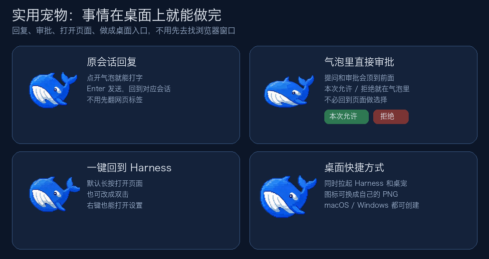
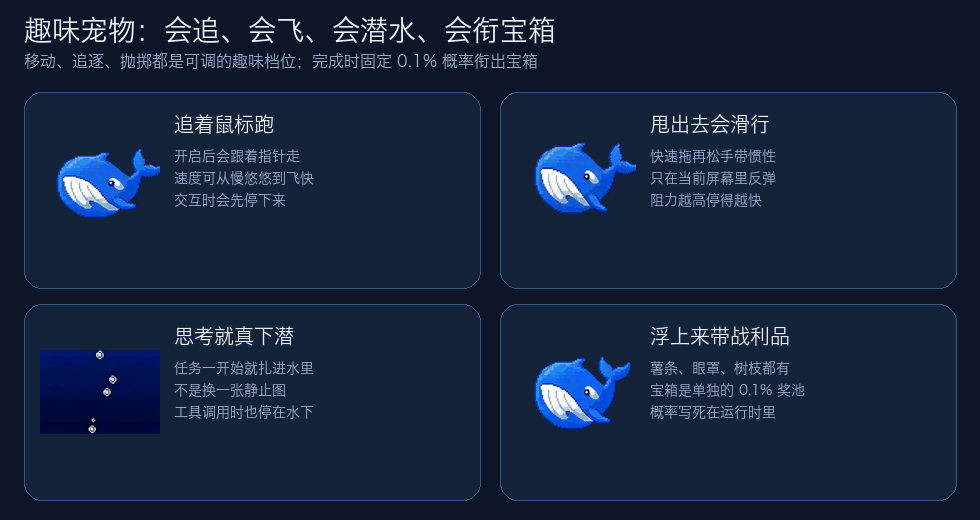
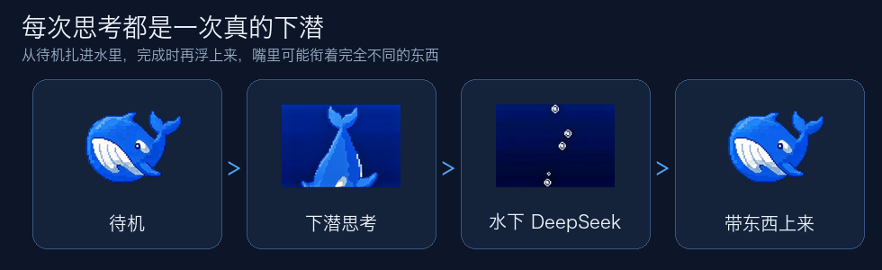
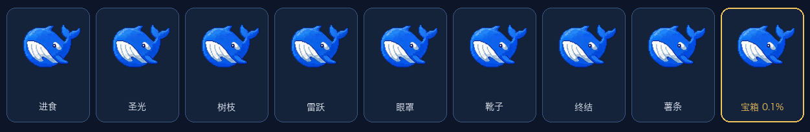
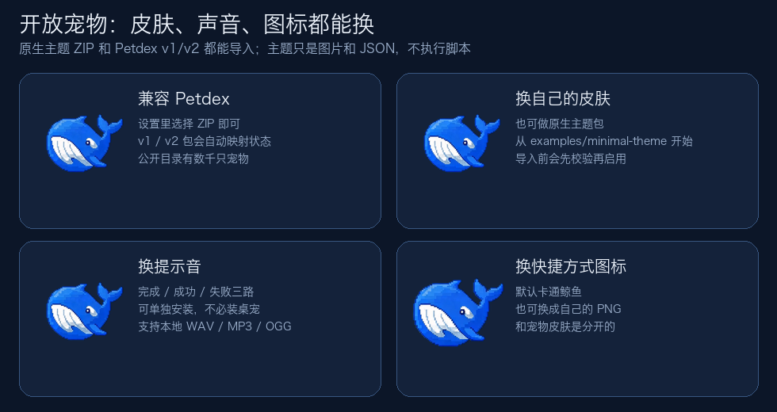

<p align="center">
  
</p>

<h1 align="center">XY DeepSeek Pet</h1>

<p align="center">
  中文 · <a href="./README.en.md">English</a>
</p>

<p align="center">
  
  
  
  
  
  
  
</p>

<p align="center">
  非官方、开源的 DeepSeek Harness 桌面宠物。<br>
  它能在桌面上把事情做完，也会追着你玩，还能换成你自己的皮肤。
</p>

<p align="center">
  <a href="#实用宠物">实用</a> ·
  <a href="#趣味宠物">趣味</a> ·
  <a href="#开放宠物">开放</a> ·
  <a href="#安装">安装</a> ·
  <a href="#使用">使用</a> ·
  <a href="#开发">开发</a>
</p>

<p align="center">
  
</p>

## 它是什么

一句话：一只跟着真实 Harness 任务活着的小鲸鱼。

任务一开始，它会扎进水里思考；工具在跑，它就停在水下；问你问题或等你审批时，气泡会顶到前面。你可以直接回原会话、在气泡里点“本次允许 / 拒绝”，或长按鲸鱼用系统语音输入回复。做完之后，它再浮上来，嘴里可能衔着完全不同的东西。

它不是浏览器里的装饰图，也不是只能换皮肤的摆件。竞争力就三件事：

| 它是 | 你得到的 |
| --- | --- |
| 实用宠物 | 回复、审批、打开页面、做成桌面入口，都不用先去找浏览器窗口 |
| 趣味宠物 | 追鼠标、被甩出去、真下潜，上来还可能衔着薯条或宝箱 |
| 开放宠物 | 换皮肤、换音效、换快捷方式图标，并兼容 [Petdex](https://petdex.dev/) |

桌宠只展示公开助手文字，以及“思考中 / 调用工具 / 等待回答 / 等待审批”。隐藏的 `reasoning-delta`、完整对话、原始工具参数、审批理由和桥接凭据都不会出桌面桥。

## 实用宠物

事情在桌面上就能做完。

<p align="center">
  
</p>

- **回原会话**：最多三个会话气泡。点开就能打字，`Enter` 发送，`Shift+Enter` 换行。回复会回到对应会话，不用先翻网页标签。
- **在气泡里做选择**：提问会明确提示；审批可以直接点“本次允许 / 拒绝”。不必为了一个确认跳回页面。
- **系统语音输入**：默认长按 `0.5` 秒开始录音，松开后把识别文字放进最近会话的回复框；双击默认打开 Harness。两种手势都能在“交互动作”中独立改成“录音”“打开最近会话详情”“打开 Harness”或“无动作”。双击录音时，再双击或点击发送即可停止；识别结果始终先供确认，不会自动发送。
- **桌面快捷方式**：设置里可创建一个同时拉起 Harness、网页和桌宠的入口。图标可用默认小鲸鱼，也可以换成自己的 PNG。

侧边栏的“打开桌宠 / 关闭桌宠”是真开关。只关桌宠不会停掉 Harness。

## 趣味宠物

它会玩，而且玩的是真实任务状态，不是循环播放一张待机图。

<p align="center">
  
</p>

- **追着鼠标跑**：打开后会跟着指针走，速度可调。你去点它、拖它或回消息时，会先停下来。
- **可以被甩出去**：快速拖再松手会带着惯性滑出去，只在当前屏幕里反弹。阻力越高，停得越快。
- **DeepSeek 时真下潜**：任务一开始就扎进水里，不是换一张静止图。工具调用时也停在水下。
- **每次上来带的东西不一样**：常规完成会均分薯条、眼罩、树枝、靴子等战利品。宝箱是单独奖池，固定 `0.1%`，也就是大约一千次完成里会有一次。这个概率写死在运行时里，主题包改不了。

<p align="center">
  
</p>

<p align="center">
  
</p>

闲着时它会自己游一会儿；十分钟没人理就会打瞌睡。按一下会被按扁再弹回来。大小可在 20% 到 200% 之间调。

## 开放宠物

默认小鲸鱼只是第一套皮肤。外观、声音、快捷方式图标都是可替换的数据，不是写死在程序里的。

<p align="center">
  
</p>

- **兼容 Petdex**：设置里选择 ZIP 即可导入 [Petdex](https://petdex.dev/) v1 / v2 宠物包。公开目录收录了数千只宠物；导入时会校验并映射到桌宠状态，不会执行包里的脚本。
- **也能用原生主题**：从可直接导入的 [`examples/minimal-theme`](./examples/minimal-theme/) 开始，按[主题制作指南](./docs/theme-authoring.md)和 [`schemas/theme.schema.json`](./schemas/theme.schema.json) 做自己的包。
- **音效可换**：可选的 `xy-deepseek-sounds` 管任务完成、工具成功和工具失败。三路可单独开关，也可导入不超过 10 秒的本地 WAV / MP3 / OGG。不装桌宠也能单独用。
- **快捷方式图标可换**：宠物皮肤和桌面图标是分开的。换主题不会改快捷方式；快捷方式也可以用自己的 PNG。

主题只含图片和 JSON。不接受脚本、网址或 shell 命令，也不会拦截 Harness 的全局文件拖入。兼容范围见[主题兼容说明](./docs/theme-compatibility.md)。

装好之后，Harness agent 也知道这些接口。你可以直接说“帮我换一个本地宠物包”或“把任务完成提示音换成这个文件”。

## 安装

需要 DeepSeek Harness `0.1.0-rc.6` 和 Node.js 22 或更高版本。当前走 Harness 的 `web` profile。

1. 如果 `dsh web` 正在运行，先回到启动它的终端按 `Ctrl+C`，等进程退出。
2. 安装插件：

   ```sh
   dsh plugin --profile web add xy-deepseek-pet
   ```

   桌面运行时 `xy-deepseek-desktop` 会自动跟上。第一次还要下载当前平台的 Electron，大约 120-150 MB；终端可能会一段时间只显示 `Downloading Electron binary...`。
3. 再启动 Harness：

   ```sh
   dsh web
   ```

侧边栏随后会出现“打开桌宠”。第一次不会自动弹出来，可在“设置 > 插件 > 桌面宠物”里打开“随 Harness 启动”。不要在旧服务还占着 3080 时再开一份 `dsh web`。

提示音是可选的：

```sh
dsh plugin --profile web add xy-deepseek-sounds
```

| 安装内容 | 你会得到什么 |
| --- | --- |
| `xy-deepseek-pet` | Cordis Host 桥、Harness 设置页和 Electron 桌宠 |
| `xy-deepseek-sounds` | 完成 / 工具结果提示音，不安装 Electron |
| 两者都装 | 声音设置收进“桌面宠物”，不会重复听同一批事件 |

如果安装日志里错误地出现 `workspace:`，先确认装的是 npm registry 版本，而不是仓库目录或旧 tarball：

```sh
npm view xy-deepseek-pet@0.1.1 dependencies
dsh plugin --profile web list xy-deepseek-pet xy-deepseek-desktop
```

registry 上的 `xy-deepseek-pet@0.1.1` 依赖是普通的 `xy-deepseek-desktop: 0.1.1`，不用改成 `file:`。如果日志明确说 pnpm 拦住了 Electron 的安装脚本，到日志里写的 profile 目录运行 `pnpm approve-builds`，允许 `electron` 后再装一次。

### GitHub 离线包

每个版本的 [GitHub Releases](https://github.com/hexingyuofficial/xy-deepseek-pet/releases) 也提供三个 npm tarball 和 `SHA256SUMS`。普通用户优先使用上面的 Harness 安装命令；离线包用于没有 registry 访问、固定版本或排查安装问题的场景：

```sh
dsh plugin --profile web add ./xy-deepseek-pet-0.1.1.tgz
dsh plugin --profile web add ./xy-deepseek-sounds-0.1.1.tgz  # 可选
```

桌面包由主插件自动安装；只有离线安装提示缺少桌面包时，才先安装 `xy-deepseek-desktop-0.1.1.tgz`。发布包未签名或公证，暂不提供 `.dmg` / `.msi` / `.exe` 安装器。

## 使用

- 侧边栏开关桌宠；关桌宠不等于关 Harness。
- 单击气泡回复；审批按钮就在气泡里。
- 右键：打开 Harness、回复最近会话、打开设置、重新连接或关掉桌宠。
- 所有偏好都在 **设置 > 插件 > 桌面宠物**：主题、缩放、游动、追鼠标、抛掷阻力、全屏时是否显示、导入 ZIP、桌面快捷方式。
- 选 ZIP 后会先验证再启用。

## 平台状态

- macOS：源码构建、npm tarball 干净安装和桌面进程启动已验证。
- Windows：共用同一套 Electron 源码；安装升级、桌面进程启动和 Harness 健康状态已在 Windows 测试，语音输入仍待真机验证。
- 0.1.1 未签名、未公证，也没有独立的 `.dmg`、`.msi` 或 `.exe`。系统若拦截未知应用，请走 npm / Harness 安装，不要绕过来源不明的安全警告。

## 开发

```sh
pnpm install --frozen-lockfile
pnpm build
pnpm test
pnpm verify
```

```sh
pnpm --filter xy-deepseek-desktop start
pnpm --filter xy-deepseek-desktop dev -- --demo-error
pnpm --filter xy-deepseek-desktop dev -- --demo-approval
```

更细的说明在[架构](./docs/architecture.md)、[Cordis 集成](./docs/cordis-integration.md)和[插件 API](./docs/plugin-api.md)。

## 开源与安全

代码使用 [MIT License](./LICENSE)。默认鲸鱼和内置声音的来源、许可与哈希记在各自的 provenance 文件里。主题和菜单扩展都是数据接口。安全问题请按 [SECURITY.md](./SECURITY.md) 私下报告。

本项目与 DeepSeek 无隶属、合作或背书关系；DeepSeek 名称及相关标识归其权利人所有。
