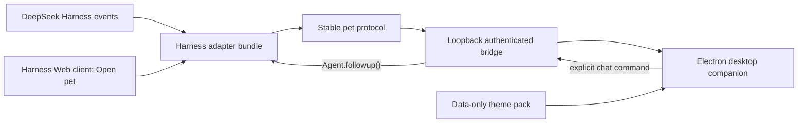

# Architecture

## Decision

Use a hybrid architecture: a small Harness bundle adapter and a separate Electron desktop application joined by a local authenticated protocol.

## Why not only a browser plugin

A browser surface cannot reliably provide a transparent, frameless, always-on-top desktop window that moves across work areas, persists its position, owns a native context menu, and behaves consistently when the Harness tab is hidden. Electron aligns with the TypeScript ecosystem and is the pragmatic MVP shell. A later Tauri renderer can reuse the protocol and theme format if package size becomes the dominant constraint.

## Components

### Harness adapter

- Selects the latest eligible root session deterministically.
- Maps release-candidate Harness events to stable pet states.
- Coalesces high-frequency text deltas before transport.
- Exposes bounded surfaced text, never inferred hidden reasoning.
- Resolves an explicit chat command to one `Agent.followup()` call.
- Owns bridge lifecycle and removes listeners on unload.

### Desktop application

- Uses one small transparent pet window rather than a full-screen click-blocking overlay.
- Expands or uses a companion window for the thought bubble and composer.
- Clamps every window to the display work area.
- Pauses autonomous movement during direct interaction.
- Loads untrusted themes as data and images only.
- Renders a compact pixel-style right-click menu from validated safe action IDs; ordinary configuration and theme selection stay in Harness Web settings.

### Harness Web client

- Ships as the bundle package's built `./client` export declared by `dsh.client`.
- Contributes an **Open pet** surface after the package is installed and Harness restarts.
- Requests launch/focus through the Host adapter; it does not attempt to create a desktop window from browser JavaScript.
- Does not claim to install the npm package. Harness's current Plugin list is read-only.

### Local bridge

- WebSocket or local IPC transport bound to `127.0.0.1` only.
- Ephemeral credential delivered out of band from normal messages.
- Version negotiation, payload limits, origin checks where applicable, and reconnect backoff.
- No transcript persistence and redacted logs by default.

## State mapping

| Harness signal | Normalized state | Notes |
| --- | --- | --- |
| Bridge unavailable | `offline` | Separate from a task error |
| Connected, no running turn | `idle` | May visually switch to `walk` during movement |
| Running before tool activity | `thinking` | Shows bounded public status; hidden reasoning deltas are discarded |
| Tool call or active step | `working` | Prevents long operations appearing frozen |
| Successful turn end | `complete` | One-shot, then `idle` |
| Agent error | `error` | One-shot, then `idle` if still connected |

Raw Harness event shapes must not cross the adapter boundary.

## Distribution boundary

`xy-deepseek-pet` owns the Host adapter, Web client, bundle patch, launcher runtime and icon. It depends on the matching `xy-deepseek-pet-desktop` package, which carries compiled Electron application code, the schema and default theme; Electron's official npm dependency supplies the platform binary. `xy-deepseek-sounds` remains independent and does not install Electron. See [packaging](./packaging.md).
